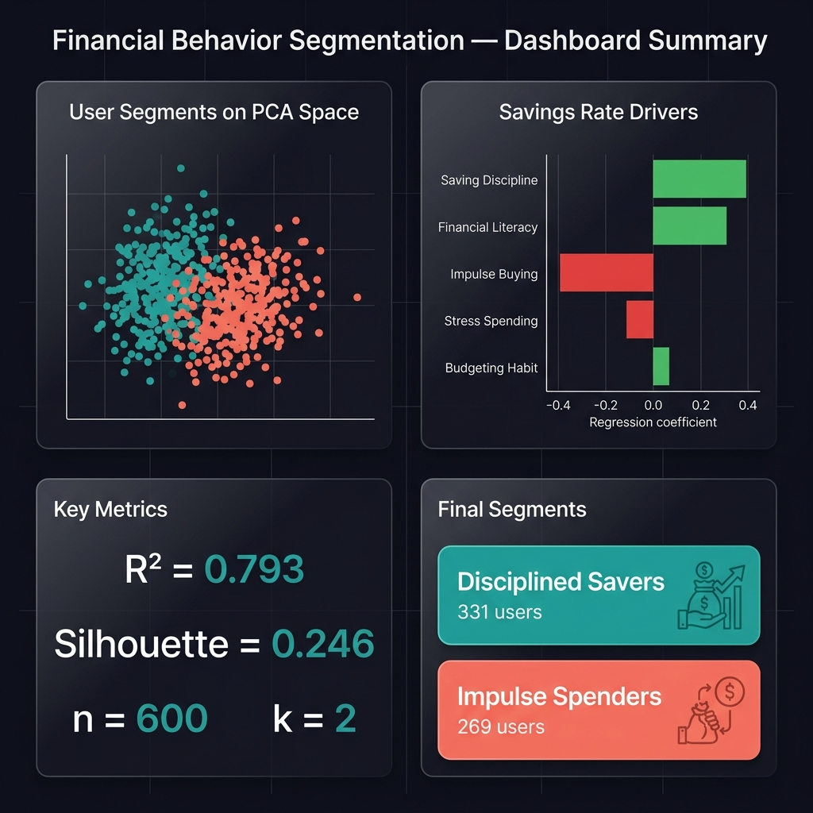
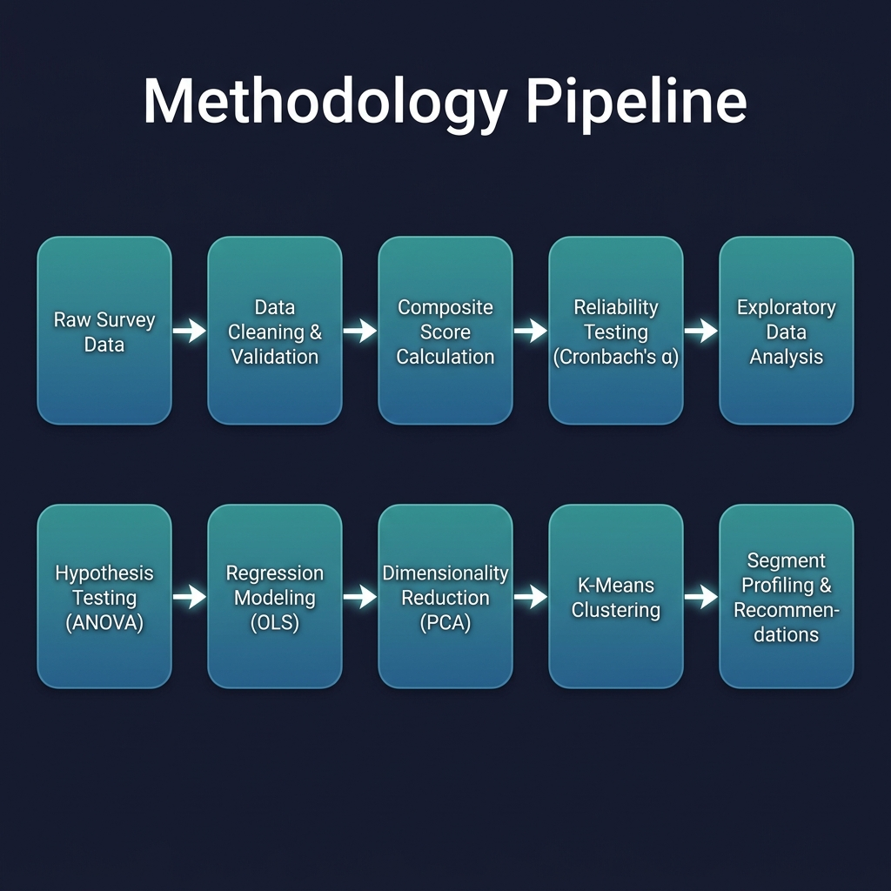
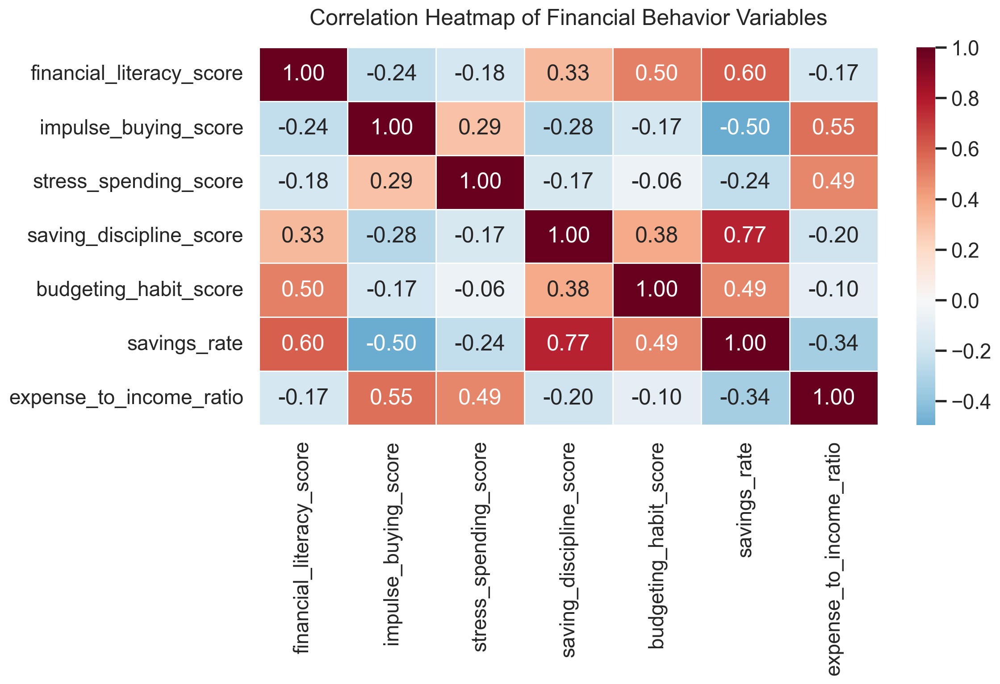
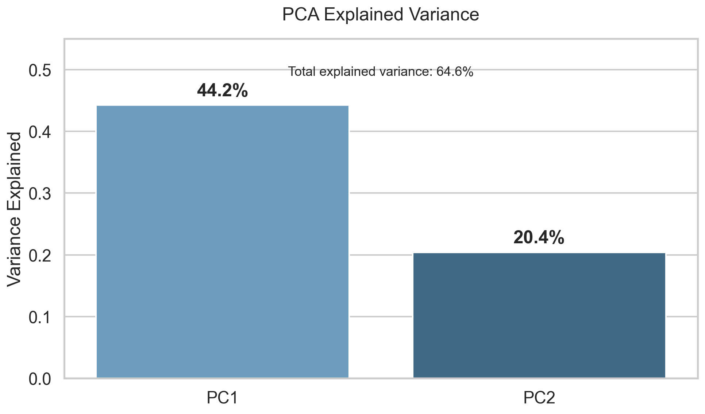
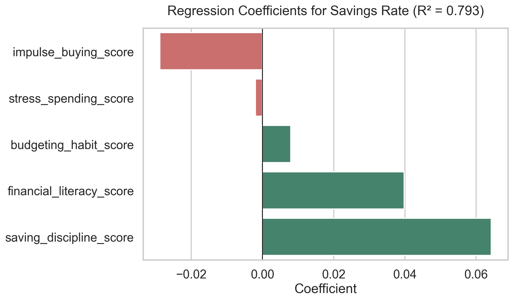
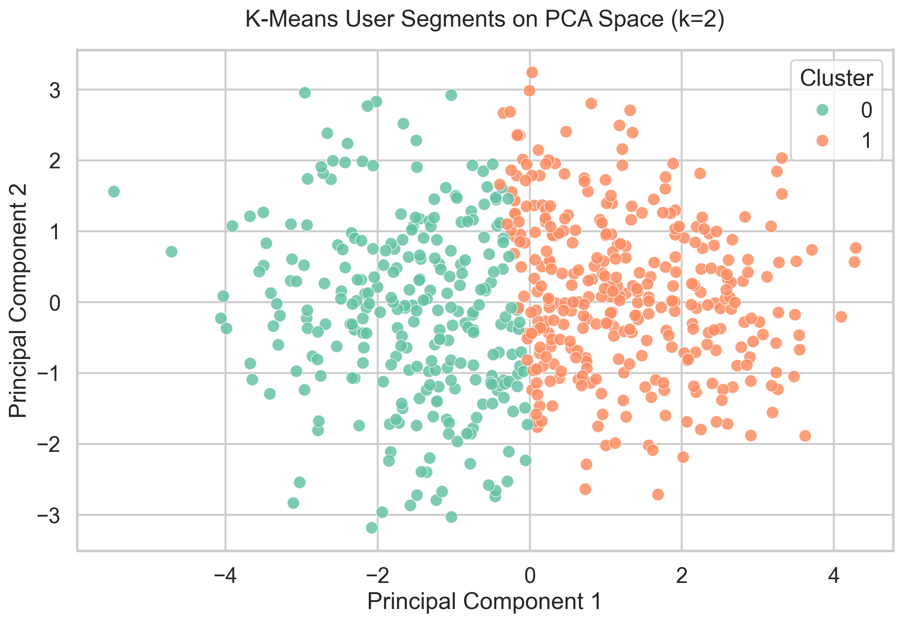

# Financial Behavior Segmentation
## Statistical Analysis and Behavioral Segmentation Using Synthetic Financial Survey Data




## Quick Summary

| Area | Result |
|---|---|
| Dataset | 600 synthetic young adult financial behavior records |
| Reliability | Cronbach's Alpha values above 0.88 |
| Strongest relationship | Impulse buying negatively related to savings rate, r = -0.495 |
| Regression performance | R² = 0.793 for savings rate prediction |
| Best clustering result | 2 clusters using K-Means, silhouette score = 0.246 |
| Final segments | Disciplined Savers and Impulse Spenders |

## 1. Business Problem

Many young adults struggle with saving money, managing expenses, controlling impulse purchases, and maintaining consistent budgeting habits. Fintech companies, personal finance apps, banks, and financial advisors can use behavioral segmentation to design better financial guidance, alerts, and personalized recommendations.

**Key Question:** Can we segment young users into meaningful financial behavior groups using statistical analysis and clustering to personalize financial products?

## 2. Objective

To analyze financial behavior among young adults (18-35) and identify meaningful behavioral segments based on income, expenses, savings, financial literacy, impulse buying, stress spending, saving discipline, and budgeting habits.

Specifically, the project aims to:
- Test relationships between psychological spending habits and actual savings rates.
- Build regression models to explain the variance in savings behavior.
- Use PCA and K-Means clustering to segment users.
- Translate mathematical clusters into actionable product recommendations.

## 3. Dataset

- **Source:** Synthetic survey and spending data generated for portfolio purposes. 📥 **[Download the Dataset](synthetic_financial_behavior_data.csv)**
- **Rows:** 600 participants (aged 18 to 35)
- **Columns:** 41 features
- **Target variable:** `savings_rate` (Monthly Savings / Monthly Income)
- **Key features:**
  - *Demographics:* Age, Gender, Employment status, City tier, Monthly income
  - *Financials:* Essential/Discretionary expenses, Monthly savings, Debt payment
  - *Behavioral Composites (1-5 Likert scale):* Financial Literacy, Impulse Buying, Stress Spending, Saving Discipline, Budgeting Habit

## 4. Tools Used

- **Python:** Primary programming language
- **pandas / numpy:** Data manipulation and feature engineering
- **scipy / statsmodels:** Hypothesis testing (ANOVA) and Multiple Linear Regression (OLS)
- **scikit-learn:** Dimensionality reduction (PCA) and clustering (K-Means), Silhouette scoring
- **matplotlib / seaborn:** Data visualization

## 5. Methodology

The end-to-end pipeline is structured as a modular Python package (`src/`):



- **Data cleaning:** Schema validation and basic checks.
- **Feature engineering:** Calculating 5 composite behavioral scores and key financial ratios (savings rate).
- **Statistical analysis:** Cronbach's Alpha for survey reliability, Pearson correlation, One-way ANOVA to test savings rate across employment groups.
- **Modeling:** OLS Regression to understand drivers of savings rate.
- **Segmentation:** Standardization, PCA for dimensionality reduction, K-Means clustering (k=2 chosen via silhouette score).
- **Validation:** Internal silhouette scoring and business logic profiling.

## 6. Results

### Main Insights

- **Impulse buying vs savings rate:** Moderate negative relationship (r = -0.495). Behavioral spending directly impacts savings outcomes more than income alone.
- **Financial literacy vs budgeting habit:** Moderate positive relationship (r = 0.501). Educational content translates directly into stickier budgeting behaviors.
- **Employment status:** Savings rate differences across employment groups were *not* statistically significant (p = 0.171), showing that behavioral intervention works across all employment types.

### Final Segments

The clustering analysis identified two primary financial behavior groups (Silhouette Score: 0.246):

| Segment | Size | Behavioral Profile | Product Opportunity |
|---|---:|---|---|
| **Disciplined Savers** | 331 users | Higher savings rate (25.9%), stronger budgeting habits, stronger saving discipline, lower impulse buying | Offer investment education, goal-based saving tools, automated savings plans, and wealth-building recommendations |
| **Impulse Spenders** | 269 users | Lower savings rate (10.9%), higher impulse buying, higher expense pressure, weaker budgeting behavior | Offer spending alerts, cool-off nudges, category limits, weekly budget reminders, and short-term savings challenges |

*Business Meaning:* Fintech apps can use these segments to offer "cool-off" nudges for Cluster 0 (Impulse Spenders) and wealth-building/investment products for Cluster 1 (Disciplined Savers).

## 7. Visuals

| Correlation Heatmap | PCA Explained Variance |
|---|---|
|  |  |

| Regression Coefficients | Cluster Visualization |
|---|---|
|  |  |

## 8. How to Run

1. **Clone repo:**
   ```bash
   git clone <repo-url>
   cd financial_behavior_segmentation
   ```

2. **Install requirements:**
   ```bash
   pip install -r requirements.txt
   ```

3. **Run the full analysis pipeline:**
   ```bash
   # Executes all 9 stages and regenerates all images in assets/
   python -m src.pipeline
   ```

4. **(Optional) Run the Jupyter Notebook:**
   ```bash
   jupyter notebook financial_behavior_segmentation_analysis.ipynb
   ```

## 9. Limitations

- **Synthetic Data:** Since the dataset is synthetic, analytical relationships (like the regression R² of 0.793) appear stronger than they would in real-world scenarios due to a lack of organic noise. 
- **Moderate Cluster Separation:** The silhouette score of 0.246 indicates moderate cluster separation, suggesting behavioral overlap between users.

## 10. Future Improvements (Real-World Validation Plan)

To upgrade this model for production-level deployment, the following steps would be taken:

1. **A/B Testing:** Deploy segment-specific nudges (e.g., cool-off alerts for "Impulse Spenders") to a holdout group and measure the actual lift in savings rate over a 3-month period.
2. **Holdout Validation:** Split real-world data 80/20. Train the KMeans model on 80% and validate cluster stability and assignment on the remaining 20%.
3. **Temporal Stability:** Re-run the clustering algorithm monthly to detect "segment drift" (e.g., users moving from Impulse Spenders to Disciplined Savers after a campaign).
4. **Alternative Algorithms:** Test Gaussian Mixture Models (GMM) to account for the overlapping nature of behavioral profiles, providing probabilities of segment membership rather than hard assignments.

---

## 👨‍💻 Author

| Name | Role | GitHub |
| :--- | :--- | :--- |
| **Rutuja Shinde** | Data Analyst / Data Scientist | [](https://github.com/Rutuja1423) |

